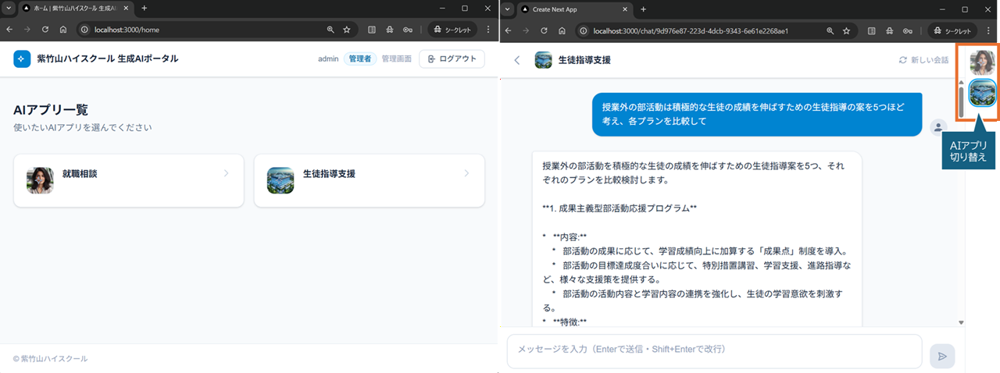
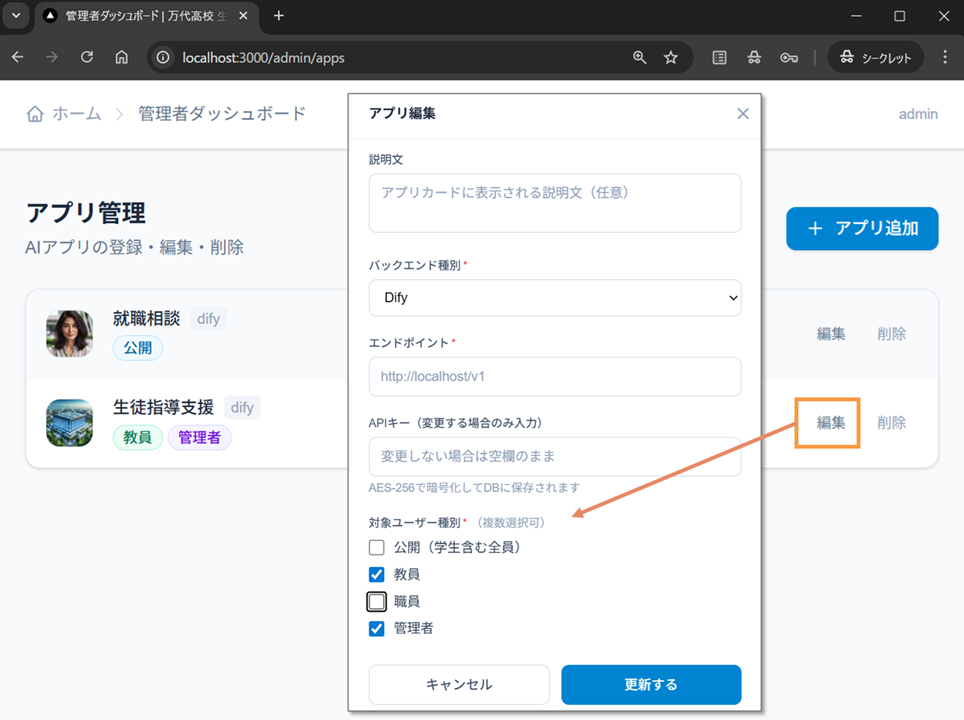

# 生成AIアプリポータル

学校・企業・行政など、多くの組織で使える **セルフホスト型の生成AIアプリポータル** です。  
Dify / Langflow で作成したAIアプリを、組織のメンバーが一画面から手軽に使えるようにします。


---

## 概要

| | |
|---|---|
| **対象** | Dify / Langflow をすでに運用しているまたはこれから運用する組織 |
| **目的** | DifyまたはLangflowによる複数のAIアプリを1つのポータルに集約し、利便性向上を行う |
| **特徴** | ログイン不要のゲストアクセスと、ロール別のアプリ出し分けを両立 |

### 主な機能

- **公開アプリ**：ログイン不要でゲストが使用可能（学生・顧客・住民など）
- **ロール別アプリ**：ログインユーザーのロールに応じて表示するアプリを切り替え
- **チャット履歴保存**：ログインユーザーのみDB保存。ゲストは保存しない
- **管理者画面**：ユーザー管理・AIアプリ登録・APIキーの暗号化保存
- **マイページ**：ユーザー自身がプロフィール・パスワードを変更可能
- **アダプターパターン**：Dify / Langflow を統一インターフェースで切り替え可能

---

## スクリーンショット

ポータル画面：アプリ一覧、アプリのUIではサイドバーでアプリ切り替え


アプリ管理画面：アプリの公開範囲を制御


---

## 技術スタック

| 項目 | 技術 |
|---|---|
| フレームワーク | Next.js 15（App Router） |
| 言語 | TypeScript |
| スタイリング | Tailwind CSS |
| データベース | SQLite（better-sqlite3）※ PostgreSQL 移行対応設計 |
| ORM | Drizzle ORM |
| 認証 | JWT（jose）/ httpOnly Cookie |
| 暗号化 | AES-256-GCM（Node.js 標準 crypto） |
| バックエンド連携 | Dify REST API / Langflow REST API |
| ネットワーク公開 | Cloudflare Tunnel（推奨） |

---

## ユーザーロール

| ロール識別子 | 説明 | ログイン | チャット保存 |
|---|---|---|---|
| `teacher` | ロールA（例：教員・一般社員） | 必要 | あり |
| `staff` | ロールB（例：職員・管理部門） | 必要 | あり |
| `admin` | 管理者 | 必要 | あり |
| ゲスト | ログイン不要ユーザー（例：学生・顧客） | 不要 | なし |

> ロール名は組織に合わせて読み替えて運用します。将来的にはカスタマイズ機能を追加予定です。

---

## 必要な環境

- **Node.js** 24 以上
- **Dify**（セルフホスト）または **Langflow**（セルフホスト）
- **Cloudflare Tunnel**（外部公開する場合）

---

## セットアップ

### 1. リポジトリをクローン

```bash
git clone https://github.com/kolinz/ai-agent-apps-portal.git
cd ai-agent-apps-portal
```

### 2. パッケージのインストール

```bash
npm install
```

### 3. 環境変数の設定

```bash
# Windows（コマンドプロンプト）
copy .env.example .env.local

# Mac / Linux
cp .env.example .env.local
```

`.env.local` を開いて以下の値を設定します：

```env
# JWT署名用シークレットキー（32バイト以上）
JWT_SECRET=（下記コマンドで生成）

# APIキー暗号化用キー（64文字の16進数・32バイト）
AES_SECRET_KEY=（下記コマンドで生成）

# DBファイルパス
DATABASE_URL=./data/portal.db

# 初期管理者アカウント
INITIAL_ADMIN_USERNAME=admin
INITIAL_ADMIN_PASSWORD=（安全なパスワードを設定）
```

**シークレットキーの生成：**

```bash
node -e "console.log(require('crypto').randomBytes(32).toString('hex'))"
```

### 4. データベースのセットアップ

```bash
# マイグレーションファイルの生成
npm run db:generate

# マイグレーションの実行（テーブル作成）
npm run db:migrate

# 管理者ユーザーの初期登録
npm run db:seed
```

### 5. 開発サーバーの起動

```bash
npm run dev
```

`http://localhost:3000` を開いてください。

---

## Dify / Langflow との接続

管理者アカウントでログイン後、`/admin/apps` からAIアプリを登録します。

### Dify の場合

| 項目 | 設定値 |
|---|---|
| バックエンド種別 | `dify` |
| エンドポイント | `http://localhost/v1`（`/v1`まで含める） |
| APIキー | Dify の「APIアクセス」から発行したキー |
| Flow ID | 不要（空欄） |

### Dify 側の作業

Difyのワークフローで、サイドバー内のアイコンをクリックし、クイック設定サイドメニューで、WebAppを無効化します。

また、バックエンドサービス APIが、稼働中になっていることを確認します。

### Langflow の場合

| 項目 | 設定値 |
|---|---|
| バックエンド種別 | `langflow` |
| エンドポイント | `http://localhost:7860` |
| APIキー | Langflow で発行したAPIキー |
| Flow ID | フローのID（URL末尾のUUID） |

---

## npm スクリプト

| コマンド | 説明 |
|---|---|
| `npm run dev` | 開発サーバー起動 |
| `npm run build` | 本番ビルド |
| `npm run start` | 本番サーバー起動 |
| `npm run db:generate` | スキーマからマイグレーションファイルを生成 |
| `npm run db:migrate` | マイグレーションをDBに適用 |
| `npm run db:seed` | 管理者ユーザーの初期登録 |
| `npm run db:studio` | Drizzle Studio（DBブラウザ）起動 |

---

## ディレクトリ構成

```
src/
├── middleware.ts              # ルートレベルのアクセス制御
├── lib/
│   ├── auth.ts                # JWT発行・検証
│   ├── session.ts             # Cookieセッション管理
│   ├── crypto.ts              # AES-256-GCM 暗号化・復号
│   ├── backends/              # Dify / Langflow アダプター
│   └── db/                    # Drizzle ORM・リポジトリ
└── app/
    ├── page.tsx               # トップページ（公開アプリ一覧）
    ├── login/                 # ログイン画面
    ├── home/                  # ホーム画面（ログイン後）
    ├── mypage/                # マイページ
    ├── chat/[appId]/          # Chat UI
    ├── admin/                 # 管理者画面
    └── api/                   # APIルート
```

---

## 本番環境へのデプロイ

### Cloudflare Tunnel を使ってインターネット公開する場合

```bash
# cloudflared のインストール（Windows）
winget install Cloudflare.cloudflared

# ログイン
cloudflared tunnel login

# トンネル作成
cloudflared tunnel create ai-portal

# トンネル起動
cloudflared tunnel --url http://localhost:3000 run ai-portal
```

### 本番ビルドと起動

```bash
npm run build
npm run start
```

---

## セキュリティについて

- **APIキーの保護**：DifyやLangflowのAPIキーはAES-256-GCMで暗号化してDBに保存。ブラウザには一切渡しません
- **JWT**：`httpOnly Cookie` に保存し、XSS攻撃によるトークン窃取を防止
- **パスワード**：bcryptjs（コストファクター12）でハッシュ化
- **操作ログ**：ユーザー管理操作（追加・削除・ロール変更）はすべて監査ログに記録

> `.env.local` と `data/` ディレクトリは `.gitignore` に含まれており、リポジトリには含まれません。

---

## 今後の予定

- [ ] ロール名のカスタマイズ（管理画面から設定）
- [ ] メール通知（パスワードリセット）
- [ ] PostgreSQL 対応（移行ガイド付き）
- [ ] Docker Compose 対応
- [ ] 多言語対応（i18n）

---

## ライセンスおよびクレジット

MIT License © 2026

本プロジェクトは以下のオープンソースパッケージを使用しています：

| パッケージ | ライセンス |
|---|---|
| [Next.js](https://github.com/vercel/next.js) | MIT |
| [React](https://github.com/facebook/react) | MIT |
| [Tailwind CSS](https://github.com/tailwindlabs/tailwindcss) | MIT |
| [better-sqlite3](https://github.com/WiseLibs/better-sqlite3) | MIT |
| [bcryptjs](https://github.com/dcodeIO/bcrypt.js) | MIT |
| [jose](https://github.com/panva/jose) | MIT |
| [uuid](https://github.com/uuidjs/uuid) | MIT |
| [drizzle-orm](https://github.com/drizzle-team/drizzle-orm) | Apache-2.0 |
| [drizzle-kit](https://github.com/drizzle-team/drizzle-orm) | Apache-2.0 |
| [TypeScript](https://github.com/microsoft/TypeScript) | Apache-2.0 |
